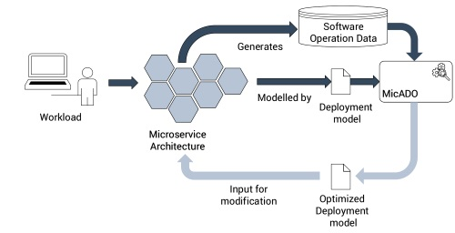
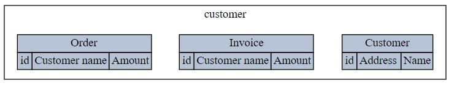

# MicADO


## Introduction

##### MicADO (Microservice Archicture Deployment Optimizer) is a tool designed to improve the performance of a microservice architecture by workload-based feature clustering.



As shown in the above overview picture, the input for MicADO is a ``Deployment Model``, that models the microservice deployment that should be optimized. Secondly a model of the  ``Workload`` of the application is provided as input. Based on this, MicADO will use a genetic algorithm to find a better deployment for this workload. The suggested deployment is then outputted in the form of a Deployment Model.

This tool is the result of a [thesis research](https://dspace.library.uu.nl/bitstream/handle/1874/348022/thesis-3816958-microservices.pdf?sequence=1), resulting in the ['Workload-Based Clustering of Coherent Feature Sets in Microservice Architectures'](http://ieeexplore.ieee.org/document/7930194) paper.
For more information about MicADO we refer the user to these documents. It should be noted that the thesis describes the V2 format, which has been replaced by V3 (described below).


## Requirements
- .Net Framework 4.6.1 (C# 7.0)


## Dependencies
- Newtonsoft.Json (10.0.3)
- CommandlineParser (2.1.1-beta)

**(Optional) Visualizer dependencies:**
- [Dot.exe](http://www.graphviz.org/Download..php)

**Testing dependencies:**
- FakeItEasy (4.0.0)
- NUnit (3.7.1)

## Installation
```git
    git clone https://github.com/AFASResearch/MicADO
  ```

Open ``Micado.sln`` in Visual Studio (2017). Now build the entire solution (this should automatically restore the nuget packages, otherwise you have to restore them manually). Next you can run the Visualizer and the Sampleimplementation, as described below in the 'Getting started' section.

## Getting started

The downloaded solution contains two console projects that can be executed: ``MicADO.Visualizer`` and ``SampleImplementation``. As the names indicate, the Visualizer project can be used to generate a SVG representation of a Deployment Model. The SampleImplementation project provides a sample for users that want to use MicADO for their microservice architecture.


## Running the Visualizer
After you have build the solution, you can execute the ``Micado.Visualizer`` executable. This program takes the following arguments:

```shell
  -d, --deployment    Required. The deploymentmodel that should be visualized
  -o, --output        Required. Filepath to the output svg file
  -r, --render        Required. Filepath to the dot.exe binary
  --help              Display this help screen.
  --version           Display version information.
```

You can call it from the root of this repository (after a debug build):
```shell
MicADO.Visualizer\bin\Debug\MicADO.Visualizer.exe -d SampleImplementation\deploymentmodel.json -o C:\temp\deployment.svg -r <your path to dot.exe here>
```

This will create an SVG file at C:\temp\deployment.svg containing a visual representation of your deployment model.
Below an example of the visualized deploymentmodel of the sampleImplementation is shown. The grey items show 'public' feature instances, while the white inner-boxes represent internal feature instances.



## Deployment models

As mentioned in the introduction, the details of the old deployment model format are described in the thesis. Hence this section will mainly focus on the version 3 deploymentmodel:

Example ``deploymentmodel.json``
```json
{
    "version" : 3,
    "features" : [
        {
            "id": "feature_id",
            "name": "feature_name",
            "properties": [
                {
                    "id": "property_id",
                    "name": "property_name",
                    "weight": 1
                }
            ]
        }
    ],
    "relations" : [
        {
            "sourceId": "property_id",
            "targetId": "another_property_id"
        }
    ],
    "microservices": [
        {
            "features": [
                {
                    "type": "feature_id",
                    "internal": false,
                    "properties": [
                        "property_id",
                        "another_property_id"
                    ]
                }
            ]
        }
    ]
}
```

The json format consists of several elements. First of all the ``version`` element that indicates that this is a version 3 deployment model. 
Secondly the ``features`` array describes all features that are present in this microservice architecture. 
A `feature` is a chunk of functionality that delivers business value. It is represented by a unique `id`, a user friendly (non-unique) `name`, and an array of `properties`. A `property` contains a unique `id`, 
a (non-unique) user friendly `name` and `weight`. The weight can be used to express that a particular property is heavier than others (i.e. a rich text field may be heavier to handle than a boolean). 

The `relations` field describes dependencies between properties. This is done by a (``sourceId``,``targetId``) object. The ``sourceId`` refers to the `id` of the property that has a dependency on the property identified by it's `id` value in the `targetId` field. 

The `microservices` array describes the `microservice`'s in the system. Every microservice is defined by an array of `features`. This array contains `feature instances`, i.e. instances of the features defined in the top-level `features` element. 
These feature instances can either be internal (not queryable by other microservices) or public (queryable by other microservices). Every feature MUST have only one public feature instance in the entire deployment.
The ``type`` of a feature instance refers to the ``id`` of a feature in the ``features`` top-level array. The ``internal`` attribute determines whether this feature instance is internal or not. Finally the `properties` array refers to the ``id``'s of of properties of features in the top-level ``features`` array.
This array indicates which properties are available for this (internal) instance. A public feature instance MUST always have all properties defined by the feature.

## Running The SampleImplementation

``shell

  -d, --deployment    Required. Filepath to a deploymentmodel

  -o, --output        Filepath to which the optimized deploymentmodel will be outputted, default optimized_deploymentmodel.json in the same directory

  --help              Display this help screen.

  --version           Display version information.
```

You can call it from the root of this repository (after a debug build):
```shell
cd SampleImplementation\bin\Debug
SampleImplementation.exe -d deploymentmodel.json -o C:\temp\optimized_deploymentmodel.json
```


## Using the MicADO framework for your case

We have included a ``SampleImplementation`` that shows an implementation of the MicADO framework. 
The main method to use the MicADO framework is to create an instance of the ``IGeneticAlgorithm<TWorkload,TState>``, typically by deriving from the ``GeneticAlgorithm<TWorkload, TState>`` abstract class.
By implementing the abstract constructor, you can pass all required components of the genetic algorithm. 
As shown by the SampleImplementation, you can use several components provided by MicADO.
Minimally you need to create a ``Workload`` and an corresponding ``IFitnessEvaluater``.

We suggest you take a look at the source code of the ``SampleImplementation``. MicADO provides a ``QueueingTheoryInfo`` representation that contains the theory described in the paper to calculate the new queueing theory metrics as a result of merging two microservices. In case you still have questions after looking at the ``SampleImplementation`` feel free to contact us.


## LICENSE

See License.txt file
